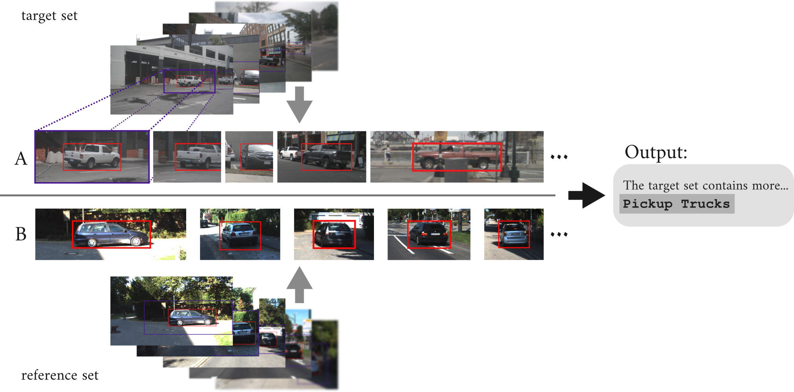

# AD-Diff: Understanding Autonomous Driving Datasets by Describing Differences between Image Subsets in Natural Language

[](https://opensource.org/license/Apache-2.0)
[](https://www.python.org/downloads/release/python-3120/)

This repository provides the source code for our paper: **TODO**

Note: The code in this repository is licensed under Apache-2.0. The datasets are subject to separate, more restrictive terms (see below).

## Abstract

Understanding the composition of large-scale autonomous driving datasets is essential for safety, robustness, and reliable operation across domains.
For example, domain shift between locations could lead to the operating environment being misaligned with the training data, resulting in potentially dangerous performance degradation.
Yet, existing data analysis pipelines largely rely on metadata, predefined labels, or manual inspection, which provide limited semantic insight or do not scale.
This paper studies *set difference captioning*: given two subsets of images, the goal is to produce a natural-language hypothesis describing differences between the target and reference set.
Building on a two-stage formulation, we adapt the method to autonomous driving by focusing on object-centric patches derived from object detection, which simplifies aggregation and enables attribution of differences to specific object instances or categories.
To evaluate this setting in-domain, we introduce a new benchmark, AD-Diff Bench.
Low-*concentration* experiments assess the suitability of set-difference-captioning approaches to sparse, real-world differences.
We restrict our experiments to open-weight models to support reproducibility and ease of deployment.
The proposed benchmark and analysis provide a step towards practical, human-interpretable dataset introspection for autonomous driving datasets.

</img>

## Installation

1. In a Python 3.12+ environment: `pip install -r requirements.txt`
	- only if you want to also use the feature-based proposer: additionally install transformers, torch, and torchvision
2. Set up [vLLM](https://vllm.ai/). Using docker:
   - `docker pull vllm/vllm-openai:latest`
   - `docker pull vllm/vllm-openai:gptoss`
   - `docker pull juliantruetsch/vllm-openai-v0.13.0-siglip2-patch` (vLLM patched for usage with SigLIP2, required for the ranker)

## Prepare Benchmark Datasets

AD-Diff Bench, our benchmark dataset, consists of three splits: annotation-filtered, CLIP-filtered, and web-scraped.

### Annotation-filtered and CLIP-filtered splits
First download the tar-file containing the configs and image patches from KITTI and nuImages `AD-Diff_Bench-ad-datasets.tar.gz` from [here](https://www.mrt.kit.edu/ad-diff-bench/).
By downloading, you agree to comply with to the copyright and license terms at the end of this readme.

Extract the tar-file in the root of the repository: `tar xf AD-Diff_Bench-ad-datasets.tar.gz`

#### Waymo Image Patches
Unfortunately, the license of the Waymo Open Perception Dataset does not permit easy publishing of derivative datasets. You need to extract the patches from the downloaded dataset yourself:
1. Download the [Waymo Open Perception dataset v2.0](https://waymo.com/open/download/) 
2. Create a new Python environment for the extraction and install the dependencies. The waymo open dataset tool unfortunately only works with Python 3.10.
	- `conda create -n ad-diff-waymo python=3.10`
	- `conda activate ad-diff-waymo`
	- `pip install -r data/waymo-requirements.txt`
3. extract the image patches from waymo. This can take >20h (!)
   - `python extract_image_patches.py recreate --path ad-datasets/extracted_patches/waymo/ --root <waymo_dataset_location>`

### Web-scraped split
German copyright law does not permit us to distribute a dataset of copyrighted images. We instead publish the list of URLs from which you can download the images used in the evaluations in the paper.

First download the tar-file containing the configs and image URLs `AD-Diff_Bench-web-scraped.tar.gz` from [here](https://www.mrt.kit.edu/ad-diff-bench/).
By downloading, you agree to comply with the copyright and license terms at the end of this readme. Please note that the images to which the URLs in this dataset point are copyrighted. This dataset is provided for non-commercial research purposes only and may not be shared or distributed.

Unpack the tar-file in the root of the repository: `tar xf AD-Diff_Bench-web-scraped.tar.gz`


#### Web-scraped images from the paper
1. `cd data/pairedimagesets/`
2. `python get_shiftbench.py download-from-urls-and-release`

#### New Web-scrape
Unfortunately, any URL-dataset will always suffer from link-rot. We therefore recommend doing a *new* web-scrape for images matching the set-descriptions of AD-Diff Bench:
1. `cd data/pairedimagesets/`
2. `python get_shiftbench.py crawl --crawl-mode=images --base-dir=webcrawl-new-images`
3. `python get_shiftbench.py release --base-dir=webcrawl-new-images --benchmark-name=New_AD-Diff_Bench`
4. `python get_shiftbench.py release-csv --benchmark-name=New_AD-Diff_Bench`

## Run Benchmark sweeps

### Launch vLLM
You first need to launch vLLM, a LLM and VLM inference engine which we use to deploy Qwen3-VL and gpt-oss. The easiest way is to use prebuild docker images for vLLM:
 1. docker for Qwen3-VL:
    ```
    docker run --runtime nvidia --gpus '"device=0,1,2,3"' \
        -v ~/.cache/huggingface:/root/.cache/huggingface \
        --env "HF_TOKEN=$HF_TOKEN" \
        -p 8000:8000 \
        --ipc=host \
        vllm/vllm-openai:latest \
        --model Qwen/Qwen3-VL-30B-A3B-Instruct \
        --reasoning-parser qwen3 --max-model-len 128000 \
        --tensor-parallel-size 4 --limit-mm-per-prompt.video 0 \
        --mm-processor-cache-gb 0 --async-scheduling
      ```
  2. docker for gpt-oss:
      ```
      docker run --runtime nvidia --gpus '"device=4,5"' \
        -v ~/.cache/huggingface:/root/.cache/huggingface \
        --env "HF_TOKEN=$HF_TOKEN" \
        -p 8000:8000 \
        --ipc=host \
        vllm/vllm-openai:gptoss \
        --model openai/gpt-oss-120b --tensor-parallel-size 2
      ```
  3. docker for SigLIP2:
      ```
      docker run --runtime nvidia --gpus '"device=6,7"' \
        -v ~/.cache/huggingface:/root/.cache/huggingface \
        -v $(pwd)/data/:$(pwd)/data/ \
        --env "HF_TOKEN=$HF_TOKEN" \
        -p 8090:8090 \
        --ipc=host \
        juliantruetsch/vllm-openai-v0.13.0-siglip2-patch \
        --port 8090 \
        --allowed-local-media-path $(pwd)/data/ \
        --model google/siglip2-giant-opt-patch16-384 \
        --runner pooling --data-parallel-size 2 --mm-processor-cache-gb 0 \
        --chat-template /usr/local/lib/python3.12/dist-packages/vllm/transformers_utils/chat_templates/template_basic.jinja
      ```
      This uses a custom image build with some patches required for SigLIP2 to work with vLLM.

  You might have to adapt the device-IDs and number of GPUs depending on your setup. We deployed the models on 8 A100 GPUs with 40GB memory per GPU. Multi-node deployment is possible. You can of course also use smaller models, if you don't have enough GPU memory available.

### Run Web-scraped sweep
  After launching vLLM, you can execute
    `python sweeps/sweep_pairedimagesets.py --bench-root="data/pairedimagesets/AD-Diff_Bench" --benchmark-name="AD-Diff_Bench" --run-name="<your_run_name>"`
  The results are logged to wandb. The sweep doesn't need any additional GPUs beside the ones used by vLLM, except if you want to test the feature based proposer.

### Run Annotation-filtered sweep
1. Choose sub-split: `export CONSUBSET="concentration_0_001"` for low-concentration experiments on the annotation-filtered-39 sub-split or `export CONSUBSET="concentration_0_125"` for the annotation-filtered-60 sub-split
2. Run sweep: `python sweeps/sweep_ad_datasets.py --bench-root="configs/metadata_filtered/splits_with_ground_truth/patches_with_padding/pad0-5_clip_bbox255-0-0_thickness5/${CONSUBSET}/"  --run-name="<your_run_name>" `
  - you can set concentration and purity with the `--concentration` and `--purity` argument
  - set `--clip-hostname`, `--vlm-hostname`, `--proposer-llm-hostname`, and `--eval-llm-hostname`, as needed if running a multi-node setup

### Run CLIP-filtered sweep
`python sweeps/sweep_ad_datasets.py --bench-root="configs/clip_filtered/patches_with_padding/pad0-5_clip_bbox255-0-0_thickness5/" --project-name="clip_filtered" --run-name="<your_run_name>" `

## Benchmark your own approach

To benchmark your own approach for object-centric set difference captioning on AD-Diff Bench, you can simply inherit from the classes in `components/proposer.py` and `components/ranker.py`. For a two-stage approach, inherit from `SamplingProposer` in `components/proposer.py`, overriding `get_hypotheses()` with your own implementation. Change the proposer method to your own in the main config file `config/base.yaml` and import it in `main.py`. Set the ranker to `CLIPRanker` in `config/base.yaml` or implement your own ranker by inheriting from `Ranker` in `components/ranker.py`. 

If you want to implement a one-stage approach, set the ranker in `config/base.yaml` to `NullRanker`. 

To implement other approaches that do *not* propose hypotheses from smaller sub-sets of the datasets, implement a proposer by directly inheriting from `Proposer` in `components/proposer.py` and override `propose()`. You can then access all images from both sets (instead of a randomly sampled subset). You can then again skip the ranker step by setting the ranker to `NullRanker`, if you want to rank your hypotheses in the proposer.

## Dataset Terms and Conditions
You must adhere to the following conditions if you download the datasets of our benchmark AD-Diff Bench:

### Web-scraped split
This dataset split consists of web-scraped URLs pointing to mostly copyrighted images. All of these images were publicly available on the web at the time the dataset was created. However, the images remain copyrighted, and all rights belong to their respective owners.

Please note that you are not allowed to share or distribute the URLs or any images downloaded from them. DO NOT UPLOAD THIS DATA TO ANY PUBLICLY ACCESSIBLE WEBSITE (including GitHub).

This dataset is intended for non-commercial research purposes only and may only be downloaded and used for this purpose.

### Annotation-filtered and CLIP-filtered split
Image patches in these datasets inherit their license from the dataset from which they were extracted:
- [KITTI](https://www.cvlibs.net/datasets/kitti/) ((c) Andreas Geiger, Philip Lenz, Christoph Stiller, Raquel Urtasun) is published under the [Creative Commons Attribution-NonCommercial-ShareAlike 3.0 License](https://creativecommons.org/licenses/by-nc-sa/3.0/).
- [nuImages](https://www.nuscenes.org/nuimages) ((c) by Motional AD Inc.) is published under the [Creative Commons Attribution-NonCommercial-ShareAlike 4.0 License](https://creativecommons.org/licenses/by-nc-sa/4.0/deed.en).
- [Waymo Open Dataset](https://waymo.com/open/) ((c) Waymo LLC) is published under the [Waymo Dataset License Agreement for Non-Commercial Use (March 2025)](https://waymo.com/open/terms/):
  > This software was made using the Waymo Open Dataset, provided by Waymo LLC under the Waymo Dataset License Agreement for Non-Commercial Use, available at [waymo.com/open/terms](waymo.com/open/terms), and your access and use of such work are governed by the terms and conditions therein.

All annotation-filtered and CLIP-filtered splits of the dataset allow non-commercial use only.

### Privacy Notice

The images referenced by this dataset were publicly available on the internet at the time of data collection. The web-scraped split does not contain image files, but only URLs that reference such publicly available content.

If you believe that this dataset contains personal data relating to you (e.g., images depicting you or your identifiable personal property), you may request the removal of the corresponding references. We recommend that you first contact the original publisher or website operator hosting the content and request deletion at the source. Once the content is removed from the originating website, it will no longer be accessible via this dataset.

Notwithstanding the above, you may exercise your rights by contacting us directly at [truetsch@fzi.de](mailto:truetsch@fzi.de). Upon receipt of a valid request, we will assess it in accordance with applicable data protection laws, and, where appropriate, remove the relevant references from our systems without undue delay.

Please note that this dataset is intended solely for non-commercial research purposes.


## Citation

If you use this repo in your research, please cite it as follows:
```
@inproceedings{AD-Diff,
  title={Understanding Autonomous Driving Datasets by Describing Differences between Image Subsets in Natural Language},
  author={Truetsch, Julian and Hauser, Felix and Bieder, Frank},
  booktitle={**TODO**},
  year={2026}
}
```
